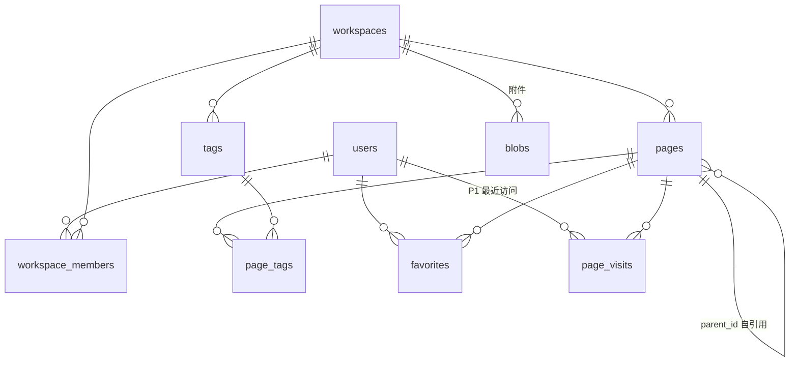

# 08 - 数据模型与存储

> 权威文档：全部表结构与文档内容存储策略（BlockNote，05）。**PostgreSQL 18 唯一数据库**，Drizzle ORM（`drizzle-orm/bun-sql` + `Bun.SQL` 原生驱动），不设双方言、不再出现 MySQL/SQLite 示例。实体语义见 02。

## 1. 全局约定

| 项 | 约定 |
|----|------|
| 主键 | UUID v7（服务端生成，时间有序） |
| 时间 | `timestamptz`，一律 UTC，ISO 8601 出 API |
| 命名 | 表/列 snake_case；Drizzle schema 单文件按表分区注释 |
| 软删除 | 仅 users（`deleted_at`）与 pages（`is_trash`，语义是回收站不是删除）；其余物理删除 |
| 迁移 | drizzle-kit 生成 SQL，`migrate` 于服务启动时执行（07 §2）；迁移前先取 PG advisory lock，防止多实例并发迁移 |
| 扩展 | 迁移开头执行 `CREATE EXTENSION IF NOT EXISTS pg_trgm;`（§3.3/§6 的 trigram 索引依赖）；其余用 PG 内置，不引 zhparser |
| 字符集 | UTF-8（PG 默认），中文是一等公民 |

## 2. 实体关系



## 3. 表结构（DDL）

### 3.1 users

```sql
create table users (
  id            uuid primary key,
  email         text not null unique,          -- 存小写
  password_hash text not null,
  name          text not null,
  avatar_url    text,
  locale        text,                          -- 语言偏好（13 §3）：'zh-CN' | 'en'，空=未设置（用默认）
  created_at    timestamptz not null default now(),
  updated_at    timestamptz not null default now(),
  deleted_at    timestamptz                    -- 软删，登录拒绝
);
```

### 3.2 workspaces / workspace_members

```sql
create table workspaces (
  id         uuid primary key,
  name       text not null,
  avatar_url text,
  created_by uuid not null references users(id),
  created_at timestamptz not null default now()
);

create table workspace_members (
  workspace_id uuid not null references workspaces(id) on delete cascade,
  user_id      uuid not null references users(id) on delete cascade,
  role         text not null check (role in ('owner','admin','member')),
  created_at   timestamptz not null default now(),
  primary key (workspace_id, user_id)
);
create index idx_members_user on workspace_members(user_id);   -- 我的空间列表
```

### 3.3 pages（页面元数据 + 派生缓存）

```sql
create table pages (
  id              uuid primary key,
  workspace_id    uuid not null references workspaces(id) on delete cascade,
  title           text not null default '',     -- 真相即本列（PATCH 唯一写入口）
  content         jsonb,                        -- 文档内容真相：BlockNote 块数组（05 §2）
  icon            text,                         -- emoji 或图片 url
  is_trash        boolean not null default false,
  deleted_at      timestamptz,                  -- 进回收站时间（自动清理依据）
  is_template     boolean not null default false,
  parent_id       uuid,                         -- 派生缓存：子页面块推导，顶级为 NULL
  position        double precision not null default 0, -- 兄弟排序键：拖拽换序/换父中点插入，耗尽时整列重铺
  text            text not null default '',     -- 派生缓存：正文纯文本（搜索用）
  search_tsv      tsvector                      -- 生成列（§6）
    generated always as (to_tsvector('simple', coalesce(title,'') || ' ' || coalesce(text,''))) stored,
  created_by      uuid not null references users(id),
  created_at      timestamptz not null default now(),
  updated_at      timestamptz not null default now()   -- 最后收到 update 的时间
);
create index idx_pages_ws on pages(workspace_id) where not is_trash;
create index idx_pages_parent on pages(parent_id) where parent_id is not null;
create index idx_pages_search on pages using gin(search_tsv);
create index idx_pages_trgm on pages using gin (title gin_trgm_ops, text gin_trgm_ops);
```

> `text` 是派生缓存（服务端从 content JSON 提取，§5）；`title` 真相即本列（PATCH 唯一写入口）；`parent_id` 由树操作端点直接持有。服务端不接受客户端直接写 `text`。
>
> `content`（BlockNote 块数组 JSONB）是**文档内容真相**：GET/PUT /doc 直读直写（05 §2）。
>
> 树序 = `position asc, created_at asc`；move（10 §4）中点插入，间隔 < 1e-9 时同层兄弟重铺为 1..n（移动页落空槽）——`position` 非派生缓存，是服务端持有的排序真相。

### 3.4 文档内容（BlockNote，原 Y.Doc 存储已退役）

- 原 `page_updates`/`page_snapshots`（yjs 增量流 + 快照）随 BlockSuite→BlockNote 迁移删除（迁移 0002，破坏性：Phase 0 未上线无存量，二进制不转换）；
- 文档 = BlockNote 块数组 JSON 存 `pages.content`，整体读/写（05 §2；能力清单见 05 §2）；≤1MB；
- 无增量流、无快照合并任务；并发写 last-write-wins（05 §7）。

### 3.5 其余表

```sql
create table blobs (
  id          text primary key,                 -- 内容寻址（sha256 前 32 位）或 nanoid
  workspace_id uuid not null references workspaces(id) on delete cascade,
  mime        text not null,
  size        integer not null,
  data        bytea not null,                   -- MVP 库内存储；对象存储接入后此列外移（§7）
  created_by  uuid not null references users(id),
  created_at  timestamptz not null default now()
);

create table tags (
  id           uuid primary key,
  workspace_id uuid not null references workspaces(id) on delete cascade,
  name         text not null,
  color        smallint not null default 6 check (color between 1 and 8),  -- 对应 06 §5.1 色板
  created_at   timestamptz not null default now(),
  unique (workspace_id, name)
);

create table page_tags (
  page_id uuid not null references pages(id) on delete cascade,
  tag_id  uuid not null references tags(id) on delete cascade,
  primary key (page_id, tag_id)
);
create index idx_page_tags_tag on page_tags(tag_id);

create table favorites (
  user_id    uuid not null references users(id) on delete cascade,
  page_id    uuid not null references pages(id) on delete cascade,
  created_at timestamptz not null default now(),
  primary key (user_id, page_id)
);

-- P1 建表即可，功能后开
create table page_visits (
  user_id    uuid not null references users(id) on delete cascade,
  page_id    uuid not null references pages(id) on delete cascade,
  visited_at timestamptz not null default now(),
  primary key (user_id, page_id)                -- upsert 刷新时间
);
```

Redis 键（无表）：`refresh:{token}` → 用户会话（7d）；`invite:{token}` → 邀请（7d）；`ws-ticket:{ticket}` → WS 票据（30s，取出即焚）；限流计数由限流中间件自管。Redis 只放可重建的会话/票据数据，不承载业务真相（丢失后用户重登、邀请重发即可）。

## 4. 文档内容读写语义（BlockNote）

### 4.1 读（GET /doc）

1. 读 `pages.content`；null（无内容，含新建页）→ 404 `LB_PAGE_NOT_FOUND`，前端以空文档起编辑（05 §4）；
2. 有内容 → 原样返回 JSON。无差分/无 state vector（05 §7）。

### 4.2 写（PUT /doc）

1. zod 校验（contracts `docContentSchema`，块数组 ≤ 2000）+ ≤1MB 超限 413；
2. 整体覆盖 `pages.content`，刷 `updated_at`；
3. **异步派生** text（§5，不阻塞写路径，失败仅日志）；
4. 无快照/合并任务（增量流已退役）。

### 4.3 复制页面 / 模板建页

服务端读模板 `content` 列，建新 page 时直接复制（同一 INSERT，无二段事务）；title/icon 按 10 §4 覆盖。

### 4.4 版本历史（P1）

原 page_snapshots 版本列表方案随增量流退役。若 P1 立项：PUT 时顺带把 content 存入 `page_revisions`（整列快照，简单直接），不再回到增量合并。

## 5. 派生缓存管道（text）

- 输入：PUT 到达的 content JSON（§4.2 步骤 3）；
- 提取（server `lib/editor-meta.ts`，05 §6）：正文纯文本（递归收集块 content 文本片段、tableContent 单元格、嵌套 children；未知形状跳过）；
- 写回：`pages.text`（截断 20000）。**title 不再从内容派生**：PATCH 是 `pages.title` 唯一写入口（编辑器不持有标题）；`parent_id` 由树操作端点持有；子页面/引用提取随 BlockSuite 块语义退役，P2 反链立项时基于 BlockNote 的 link 行内内容重设计。

## 6. 搜索

```sql
-- 主路径：全文
select id, title, parent_id from pages
where workspace_id = $1 and not is_trash
  and search_tsv @@ plainto_tsquery('simple', $2);
-- 兜底（CJK 短词/子串）：trigram
  or title % $2 or left(text, 20000) % $2
order by ts_rank(search_tsv, plainto_tsquery('simple', $2)) desc nulls last,
         updated_at desc
limit 20;
```

- 用 PG 内置 `simple` 配置：中文按字切分可命中词组，配合 trigram 子串兜底，**不依赖 zhparser 等扩展**（单机部署零外置依赖）；规模到十万页级再评估 zhparser（届时立变更）；
- `text` 截断 20000 字符参与 trigram（控制索引与计算量）。

## 7. 容量与演进

| 阶段 | 动作 |
|------|------|
| MVP | 全部库内（含 blob bytea）。预期单空间千页级，单页 content < 1MB，无压力 |
| blob 超过 ~5GB | `blobs.data` 外移对象存储（S3 兼容 / MinIO），表保留元数据，API 不变 |
| content 增长 | content 上限 1MB/页（413 拒绝）；超长内容拆子页（产品语义），不做库侧压缩 |

## 8. 待细化

- `page_refs` 表结构（P2 反向链接立项时定；基于 BlockNote link 行内内容重设计）；
- 版本历史（P1，§4.4）；
- 页面物理删除时 blob 孤儿回收的引用计数实现细节（trash-cleanup 任务里定）。
