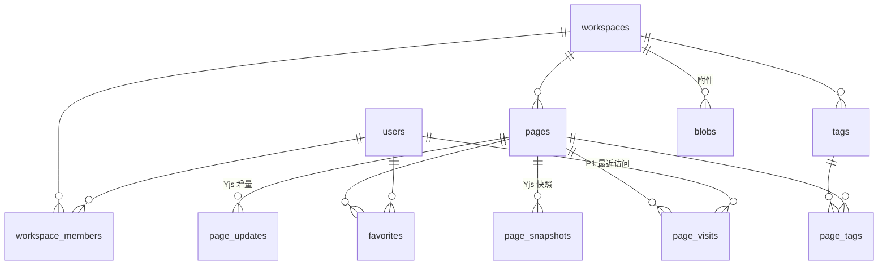

# 08 - 数据模型与存储

> 权威文档：全部表结构与 Y.Doc 存储策略。**PostgreSQL 18 唯一数据库**，Drizzle ORM（`drizzle-orm/bun-sql` + `Bun.SQL` 原生驱动），不设双方言、不再出现 MySQL/SQLite 示例。实体语义见 02。

## 1. 全局约定

| 项 | 约定 |
|----|------|
| 主键 | UUID v7（服务端生成，时间有序） |
| 时间 | `timestamptz`，一律 UTC，ISO 8601 出 API |
| 命名 | 表/列 snake_case；Drizzle schema 单文件按表分区注释 |
| 软删除 | 仅 users（`deleted_at`）与 pages（`is_trash`，语义是回收站不是删除）；其余物理删除 |
| 迁移 | drizzle-kit 生成 SQL，`migrate` 于服务启动时执行（07 §2）；迁移前先取 PG advisory lock，防止多实例并发迁移 |
| 扩展 | 迁移开头执行 `CREATE EXTENSION IF NOT EXISTS pg_trgm;`（§3.3/§6 的 trigram 索引依赖）；其余用 PG 内置，不引 zhparser |
| 字符集 | UTF-8（PG 默认），中文是一等公民 |

## 2. 实体关系



## 3. 表结构（DDL）

### 3.1 users

```sql
create table users (
  id            uuid primary key,
  email         text not null unique,          -- 存小写
  password_hash text not null,
  name          text not null,
  avatar_url    text,
  locale        text,                          -- 语言偏好（13 §3）：'zh-CN' | 'en'，空=未设置（用默认）
  created_at    timestamptz not null default now(),
  updated_at    timestamptz not null default now(),
  deleted_at    timestamptz                    -- 软删，登录拒绝
);
```

### 3.2 workspaces / workspace_members

```sql
create table workspaces (
  id         uuid primary key,
  name       text not null,
  avatar_url text,
  created_by uuid not null references users(id),
  created_at timestamptz not null default now()
);

create table workspace_members (
  workspace_id uuid not null references workspaces(id) on delete cascade,
  user_id      uuid not null references users(id) on delete cascade,
  role         text not null check (role in ('owner','admin','member')),
  created_at   timestamptz not null default now(),
  primary key (workspace_id, user_id)
);
create index idx_members_user on workspace_members(user_id);   -- 我的空间列表
```

### 3.3 pages（页面元数据 + 派生缓存）

```sql
create table pages (
  id              uuid primary key,
  workspace_id    uuid not null references workspaces(id) on delete cascade,
  title           text not null default '',     -- 派生缓存：服务端从 Y.Doc 提取（§5）
  icon            text,                         -- emoji 或图片 url
  is_trash        boolean not null default false,
  deleted_at      timestamptz,                  -- 进回收站时间（自动清理依据）
  is_template     boolean not null default false,
  parent_id       uuid,                         -- 派生缓存：子页面块推导，顶级为 NULL
  text            text not null default '',     -- 派生缓存：正文纯文本（搜索用）
  search_tsv      tsvector                      -- 生成列（§6）
    generated always as (to_tsvector('simple', coalesce(title,'') || ' ' || coalesce(text,''))) stored,
  created_by      uuid not null references users(id),
  created_at      timestamptz not null default now(),
  updated_at      timestamptz not null default now()   -- 最后收到 update 的时间
);
create index idx_pages_ws on pages(workspace_id) where not is_trash;
create index idx_pages_parent on pages(parent_id) where parent_id is not null;
create index idx_pages_search on pages using gin(search_tsv);
create index idx_pages_trgm on pages using gin (title gin_trgm_ops, text gin_trgm_ops);
```

> `parent_id`/`title`/`text` 是缓存，真相在 Y.Doc；服务不直接接受客户端写这三列（复制模板页除外，§4.4）。

### 3.4 page_updates / page_snapshots（Y.Doc 存储核心）

```sql
create table page_updates (
  id         bigserial primary key,             -- 即全局顺序 seq
  page_id    uuid not null references pages(id) on delete cascade,
  blob       bytea not null,                    -- 单条 Yjs update（二进制）
  actor      uuid not null references users(id),
  created_at timestamptz not null default now()
);
create index idx_updates_page on page_updates(page_id, id);

create table page_snapshots (
  id         bigserial primary key,
  page_id    uuid not null references pages(id) on delete cascade,
  version    integer not null,                  -- 每页自增，不回收
  blob       bytea not null,                    -- 合并后的 Y.Doc 全量状态
  reason     text not null default 'auto' check (reason in ('auto','manual','restore','copy')),
  created_at timestamptz not null default now(),
  unique (page_id, version)
);
```

## 3.5 其余表

```sql
create table blobs (
  id          text primary key,                 -- 内容寻址（sha256 前 32 位）或 nanoid
  workspace_id uuid not null references workspaces(id) on delete cascade,
  mime        text not null,
  size        integer not null,
  data        bytea not null,                   -- MVP 库内存储；对象存储接入后此列外移（§7）
  created_by  uuid not null references users(id),
  created_at  timestamptz not null default now()
);

create table tags (
  id           uuid primary key,
  workspace_id uuid not null references workspaces(id) on delete cascade,
  name         text not null,
  color        smallint not null default 6 check (color between 1 and 8),  -- 对应 06 §5.1 色板
  created_at   timestamptz not null default now(),
  unique (workspace_id, name)
);

create table page_tags (
  page_id uuid not null references pages(id) on delete cascade,
  tag_id  uuid not null references tags(id) on delete cascade,
  primary key (page_id, tag_id)
);
create index idx_page_tags_tag on page_tags(tag_id);

create table favorites (
  user_id    uuid not null references users(id) on delete cascade,
  page_id    uuid not null references pages(id) on delete cascade,
  created_at timestamptz not null default now(),
  primary key (user_id, page_id)
);

-- P1 建表即可，功能后开
create table page_visits (
  user_id    uuid not null references users(id) on delete cascade,
  page_id    uuid not null references pages(id) on delete cascade,
  visited_at timestamptz not null default now(),
  primary key (user_id, page_id)                -- upsert 刷新时间
);
```

Redis 键（无表）：`refresh:{token}` → 用户会话（7d）；`invite:{token}` → 邀请（7d）；`ws-ticket:{ticket}` → WS 票据（30s，取出即焚）；限流计数由限流中间件自管。Redis 只放可重建的会话/票据数据，不承载业务真相（丢失后用户重登、邀请重发即可）。

## 4. Y.Doc 存储与同步语义

### 4.1 读路径（pull）

客户端带 state vector 请求（10 §5.2）：

1. 取该页**最新快照**；用快照的 state vector（`Y.decodeSnapshot(snapshot).sv`）与客户端 state vector 比对，若已包含客户端状态，直接差分返回缺失字节；
2. 否则快照 + 该快照之后的全部 `page_updates` 在服务端合并（`Y.mergeUpdates`），diff 后返回；
3. 空页（无快照无 updates）→ 404，客户端以本地为准（新建页场景，05 §4）。

### 4.2 写路径（push）

1. 收到 update 二进制 → 校验大小（≤512KB/条）→ 插入 `page_updates`，刷 `pages.updated_at`；
2. **不即时合并、不即时解析**（写路径必须快）；
3. 派生缓存与搜索索引由合并任务异步对齐（§5）。

### 4.3 快照合并任务

- 触发条件（满足其一）：某页自上次快照后累计 updates ≥ 50 条；或每日全量扫描 `updated_at` 距上次快照 > 1h 的页；
- 动作：合并该页快照+增量 → 写新 `page_snapshots`（version+1, reason=auto）→ **删除已并入的 page_updates**（快照即真相，增量可回收）→ 触发派生缓存刷新（§5）；
- 崩溃安全：合并是纯函数计算，先写快照后删增量；重复执行幂等。

### 4.4 复制页面 / 模板建页

服务端取模板最新状态（快照或合并），在事务内：建新 page（新 uuid）→ 写入快照（reason=copy）→ 提取派生缓存。模板内的**子页面引用不复制**（模板约定不含子页，含则在提取时告警）。

### 4.5 版本历史（P1）

`page_snapshots` 即版本列表（auto 快照每日一次 + 手动保存 `reason=manual`）；「恢复」= 把目标快照内容作为新 update 推给客户端合并 + 写一条 `reason=restore` 快照。不做删除单版本（简单优先）。

## 5. 派生缓存管道（title / parent / text / 引用）

- 输入：合并完成的页（§4.3）或显式触发（建页、复制）；
- 提取（服务端 Bun 内，方案见 05 §6）：标题（root block 的 title 属性）、子页面 id 列表（子页面块）、正文纯文本、链接块引用的页面 id 列表（引用列表先只落日志，P2 反链功能再建 `page_refs` 表）；
- 写回：`pages.title/parent_id/text`。**一个页面最多有一个父页**（页面树语义）；若提取发现多个子页面块指向同一子页，以第一个为准并在日志告警（Yjs 并发合并的理论边缘）。

## 6. 搜索

```sql
-- 主路径：全文
select id, title, parent_id from pages
where workspace_id = $1 and not is_trash
  and search_tsv @@ plainto_tsquery('simple', $2);
-- 兜底（CJK 短词/子串）：trigram
  or title % $2 or left(text, 20000) % $2
order by ts_rank(search_tsv, plainto_tsquery('simple', $2)) desc nulls last,
         updated_at desc
limit 20;
```

- 用 PG 内置 `simple` 配置：中文按字切分可命中词组，配合 trigram 子串兜底，**不依赖 zhparser 等扩展**（单机部署零外置依赖）；规模到十万页级再评估 zhparser（届时立变更）；
- `text` 截断 20000 字符参与 trigram（控制索引与计算量）。

## 7. 容量与演进

| 阶段 | 动作 |
|------|------|
| MVP | 全部库内（含 blob bytea）。预期单空间千页级，快照均值 < 200KB，无压力 |
| blob 超过 ~5GB | `blobs.data` 外移对象存储（S3 兼容 / MinIO），表保留元数据，API 不变 |
| updates 表膨胀 | 合并任务已持续回收；极端情况按页重写全量快照清空增量 |

## 8. 待细化

- `page_refs` 表结构（P2 反向链接立项时定）；
- 快照存储是否加压缩（Y.Doc 二进制对文本压缩率 ~70%，观察体积再决定，倾向 Yjs 原生不动）；
- 页面物理删除时 blob 孤儿回收的引用计数实现细节（trash-cleanup 任务里定）。
